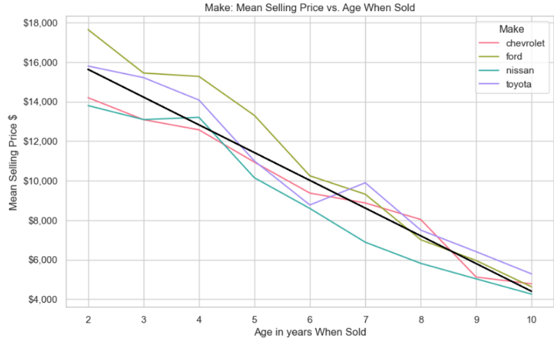
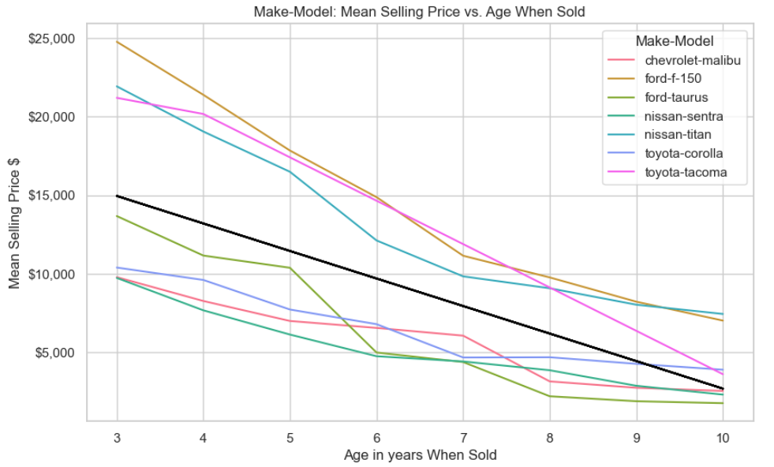
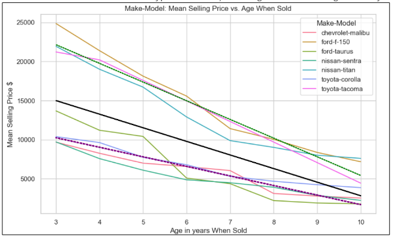

# Instructions #
- Run the final notebook 'Project_1_Group_7_Consolidated.ipynb' to see visualization and statistics.
- The data for this notebook must be in "Data/car_prices.csv".
- However, the file in Github is "Data/car_prices.zip."  The CSV is zipped due to size constraings.
- The file needs to be unzipped.
- The notebook must reside in a directory that has the following path and filename: "Data/car_prices.csv"

# Summary and Findings #
- Our team assumes that the investigation into car sales price is itterative, not a one-shot project.  Therefore, this is a preliminary analysis that will provide some recommendations and next steps.
- We found that by drilling-down into finer levels of granularity helped increate the explanatory power of our models as measured by the r-value.
- Most of the granular models did have significantly high r-values.

### Goal ###
- Our team seeks to provide actionable insights regarding car sales price changes over time.
- The goal of the project is to find and present the best models to explain variation in sales price over time.  Specifically, the goal is to find one or more models that have the highest r-value or r squared value.  For now we only look at models models with two variables.  A single regression model with multiple independent variables is ideal.  However, it might be necessary to consider multiple models.
A good example of what we would like to acheive is the correlation between Manheim Market Report (mmr) and sale price (0.98).
Manheim (MMR) website: https://site.manheim.com/en/help/mmr.html

### Approach ###
We started our analysis at a course granularity of analysis (such as car make or model) and provide statistical analysis and visualizations.  Next, we then drilled down to a finer level of granularity, such as type of car (Truck, Sedan, Luxury, etc.).  This methodology ensures that we can find the models with the highests r-values.

### Major Findings ###
As we refined the regression models (course-to-fine granularity), our explanatory power increased (higher r-value).  

Image 1 displays the difference in mean by economy, luxury and wide range makes.  The largest difference in mean price is between the luxury cars and other car types (economy and wide range makes).  This shows the need to seperate out car types, both by items such as body but also by price.

Table 1 below shows the progression from course to fine level analysis (left-to-right) for different explanatory variables.
- The table below suggests a lineage regression model with many variables can have provide a very good model.
- Seperating trucks from cars allows for a better fitting regression line (green and purple) compared to a model fit to both types of vehicles (black)l

Table 2 below shows the difference in sales price between all cars, luxury and economy cars.
- The table also suggests a lineage regression model with many variables can have provide a very good model. 
- Row 1:  Shows that seperating out economy and luxury cars improves the r-value when run against odometer. 
- Row 2:  Shows that seperating out economy and luxury cars improves the r-value when run against age. 

Table 3 below shows the mean selling price and count by season 
- The Purple line represents the mean selling price, while the blue line represents the count of sales. The analysis reveals distinct patterns across different seasons:
- - Spring: Prices are moderate, and sales are relatively low.
- - Summer: Prices significantly increase, with sales remaining consistent.
- - Winter: Prices hit their lowest point, yet sales numbers rise.
- Our recommendation
- - Overall, the analysis suggests that Winter is the best season to buy a car, as prices are lowest during this time, while Summer tends to have the highest prices.

## Image 1 ##

## Table 1: Make-Model-Type ##

| Make | Make-Model| Make-Model-Type |
|----------|----------|----------|
|Row 1:Depreciation |||

## Table 2: Sale Price Versus ##

|               | All Cars | Luxury | Economy |
|---------------|----------|--------|---------|
| **Odometer**  |  |  |  |
| **Age**       |  |  |  |

## Table 3: Mean Selling Price and Count by Season ##

### Challenges and Next Steps ###
- Use multiple variable regression model to further increase model predictions based on the work in this presentation.
- Further clean the dataset is needed.  This dataset seems to be a combination of datasets and therefore the rows are not always compable.
- Merge the dataset with datasets with other car information, such as miles per gallon, or further refine current measures, such as car type.

 Our recommendations are:
- Determine which explanatory variables help increase explanatory power, and then include these in a multiple variable regression model.
- Merging this dataset with datasets with more explanatory columns, such as miles per gallon, will help increase the explanatory power.
- The dataset is more dirty than expected.  It looks like the dataset is a combination of datasets that have different rules.  For instance, one allows 'Ford' whereas another allows 'ford'.  Furhter, it looks like condition follows two seperate codings.

## Link to ppt slides: 
https://www.canva.com/design/DAGAMoGRDvQ/zwXBi20P6FkmwyvHbD5Uyg/edit?utm_content=DAGAMoGRDvQ&utm_campaign=designshare&utm_medium=link2&utm_source=sharebutton

# Data Source and Descriptions (car_prices.csv) #
The sections below provide details on the car_prices.csv.
- We used the dataset 'car_prices.csv' from Kaggle.
- car_prices.csv was cleaned and then the output was placed in "Data/clean_car_prices.csv" was used for the analysis. 

# Data Source #
### There is a very good summary of the data in the link below.  The analysis is web-based and provides definitions and summary statistics.  This is available on a PPT seperate from the presentation PPT ###

https://www.kaggle.com/datasets/syedanwarafridi/vehicle-sales-data?resource=download
or
https://www.kaggle.com/datasets/syedanwarafridi/vehicle-sales-data/data

### Datasets ###
car_prices.csv

### Provides good code for dataset ###

https://www.kaggle.com/code/yusupibrahim/selling-price-predic-with-stacked-gen-r2-0-96 

# Kaggle Data Card #

### About Dataset ###
Note the original data was called "car_prices.csv" but this was cleaned and we used "Data/clean_car_prices.csv"

Dataset Description:
The "Vehicle Sales and Market Trends Dataset" provides a comprehensive collection of information pertaining to the sales transactions of various vehicles. This dataset encompasses details such as the year, make, model, trim, body type, transmission type, VIN (Vehicle Identification Number), state of registration, condition rating, odometer reading, exterior and interior colors, seller information, Manheim Market Report (MMR) values, selling prices, and sale dates.

### Key Features: ###
Vehicle Details: Includes specific information about each vehicle, such as its make, model, trim, and manufacturing year.

Transaction Information: Provides insights into the sales transactions, including selling prices and sale dates.

Market Trends: MMR values offer an estimate of the market value of each vehicle, allowing for analysis of market trends and fluctuations.

Condition and Mileage: Contains data on the condition of the vehicles as well as their odometer readings, enabling analysis of how these factors influence selling prices.

### Potential Use Cases: ###

Market Analysis: Researchers and analysts can utilize this dataset to study trends in the automotive market, including pricing fluctuations based on factors such as vehicle condition and mileage.

Predictive Modeling: Data scientists can employ this dataset to develop predictive models for estimating vehicle prices based on various attributes.

Business Insights: Automotive industry professionals, dealerships, and financial institutions can derive insights into consumer preferences, market demand, and pricing strategies.

### Other ###

Format: The dataset is typically presented in tabular format (e.g., CSV) with rows representing individual vehicle sales transactions and columns representing different attributes associated with each transaction.

Data Integrity: Efforts have been made to ensure the accuracy and reliability of the data; however, users are encouraged to perform their own validation and verification processes.

Update Frequency: The dataset may be periodically updated to include new sales transactions and market data, providing fresh insights into ongoing trends in the automotive industry.

# Appendix A: Columns and Datatypes #
year ( int64) The manufacturing year of the vehicle.  
make (object): The brand or manufacturer of the vehicle.  
model (object): The specific model of the vehicle.  
body (object): The vehicle’s body type (e.g., Sedan, SUV, etc.).  
transmission (object): The type of transmission in the vehicle (e.g., automatic).  
vin (object): Vehicle Identification Number, a unique code for each vehicle.  
state (object): The state where the vehicle is registered.  
condition (float64): Condition of the vehicle, possibly rated on a scale.  
odometer (float64): The vehicle’s mileage.  
color (object): Exterior color of the vehicle.  
interior (object): The vehicle’s interior color.  
seller (object): The entity that sold the vehicle.  
mmr (float64): The Manheim Market Report value (estimated market value).  
sellingprice (float64): The final price at which the vehicle was sold.  
saledate (object): The date and time of the sale.  
saleyear (int64): The year in which the vehicle was sold.  
age ( int64): The age of the vehicle at the time of sale.  
pct_mmr ( float64) The percentage of the MMR value at which the vehicle was sold.  
age_when_sold ( int64) The age of the vehicle when it was sold.  
Make-Model (object): Combined column representing the make and model of the vehicle.  
