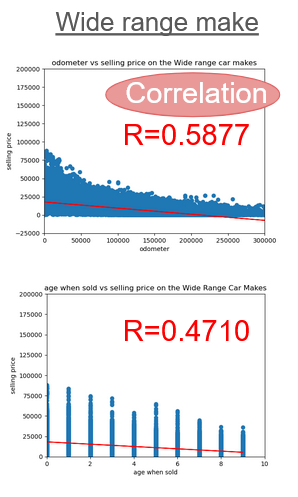
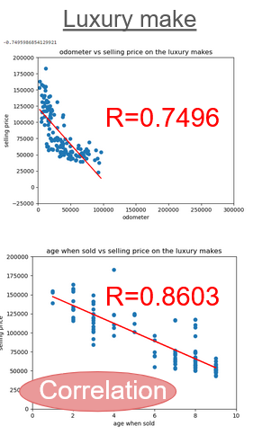
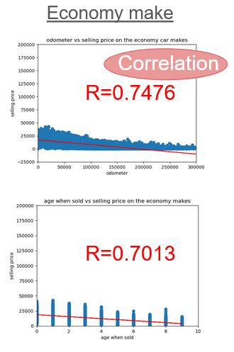

# Instructions #
- Run the final notebook 'Project_1_Group_7_Consolidated.ipynb' to see visualization and statistics that were used during this presentation.
- The file called "Data/clean_car_prices.zip" is zipped due to size constraings.
- The notebook must reside in a directory that has the following path and filename: "Data/clean_car_prices.csv"

# Analysis #

### Goal ###
We assume that the investigation into car sales price is itterative, not a one-shot project.  Therefore, this is a preliminary analysis that will provide some recommendations for future analysis.
Goal of the project is to present the best models to explain variation in sales price changes for used cars and provide next steps for future projects.  We start with a course level of data (such as car make) and then drill down to a finer level of granularity, such as type of car (Truck, Sedan, Luxury, etc.). 
### Major Findings ###
As we refined the regression models, explanatory power increased (higher r-value).  
See table 1 for following Analysis
- The table below suggests a lineage regression model with many variables can have provide a very good model. 
- Row 1:  Shows how drilling-down from make, to make-model, to focusing on type, improves the r-value of the regression model. 
- Row 2:  Shows that focusing on luxury models versus economy models improves the r-value of the regression model. 
- Row 2:  Shows that age improves the r-value of the regression model. 

--Make-Model-type

| Make | Make-Model| Make-Model-Type |
|----------|----------|----------|
|Row 1 |   | 
|Row 2  |  >|  |

Table 1 - Refining Regression Models

### Next Steps and recommendations ###
- Use multiple variable regression model to further increase model predictions based on the work in this presentation.  Here is an example one:

- Further clean the dataset
- Merge the dataset with datasets with other car information, such as miles per gallon, or further refine current measures, such as car type.

 Our recommendations are:
- Determine which explanatory variables help increase explanatory power, and then include these in a multiple variable regression model.
- Merging this dataset with datasets with more explanatory columns, such as miles per gallon, will help increase the explanatory power.
- The dataset is more dirty than expected.  It looks like the dataset is a combination of datasets that have different rules.  For instance, one allows 'Ford' whereas another allows 'ford'.  Furhter, it looks like condition follows two seperate codings.

# Data Source and Descriptions (car_prices.csv) #
The sections below provide details on the car_prices.csv.
- We used the dataset 'car_prices.csv' from Kaggle.
- car_prices.csv was cleaned and then the output was placed in "Data/clean_car_prices.csv" was used for the analysis. 

# Data Source #
### There is a very good summary of the data in the link below.  The analysis is web-based and provides definitions and summary statistics.  This is available on a PPT seperate from the presentation PPT ###

https://www.kaggle.com/datasets/syedanwarafridi/vehicle-sales-data?resource=download
or
https://www.kaggle.com/datasets/syedanwarafridi/vehicle-sales-data/data

### Datasets ###
car_prices.csv

### Provides good code for dataset ###

https://www.kaggle.com/code/yusupibrahim/selling-price-predic-with-stacked-gen-r2-0-96 

# Kaggle Data Card #

### About Dataset ###
Note the original data was called "car_prices.csv" but this was cleaned and we used "Data/clean_car_prices.csv"

Dataset Description:
The "Vehicle Sales and Market Trends Dataset" provides a comprehensive collection of information pertaining to the sales transactions of various vehicles. This dataset encompasses details such as the year, make, model, trim, body type, transmission type, VIN (Vehicle Identification Number), state of registration, condition rating, odometer reading, exterior and interior colors, seller information, Manheim Market Report (MMR) values, selling prices, and sale dates.

### Key Features: ###
Vehicle Details: Includes specific information about each vehicle, such as its make, model, trim, and manufacturing year.

Transaction Information: Provides insights into the sales transactions, including selling prices and sale dates.

Market Trends: MMR values offer an estimate of the market value of each vehicle, allowing for analysis of market trends and fluctuations.

Condition and Mileage: Contains data on the condition of the vehicles as well as their odometer readings, enabling analysis of how these factors influence selling prices.

### Potential Use Cases: ###

Market Analysis: Researchers and analysts can utilize this dataset to study trends in the automotive market, including pricing fluctuations based on factors such as vehicle condition and mileage.

Predictive Modeling: Data scientists can employ this dataset to develop predictive models for estimating vehicle prices based on various attributes.

Business Insights: Automotive industry professionals, dealerships, and financial institutions can derive insights into consumer preferences, market demand, and pricing strategies.

### Other ###

Format: The dataset is typically presented in tabular format (e.g., CSV) with rows representing individual vehicle sales transactions and columns representing different attributes associated with each transaction.

Data Integrity: Efforts have been made to ensure the accuracy and reliability of the data; however, users are encouraged to perform their own validation and verification processes.

Update Frequency: The dataset may be periodically updated to include new sales transactions and market data, providing fresh insights into ongoing trends in the automotive industry.

# Requirements #

### Completed Analysis Uploaded to GitHub (20 points)

-Final data analysis contains ample and complete information in README file (10 points) - car_prices.csv, clean_car_prices.csv and readme
-Final repository is acceptable for professional quality presentation (10 points)

### Visualizations (20 points)

-6–8 visualizations of data (at least two per question) (10 points)
-Clear and accurate labeling of images (5 points)
-Visualizations supported with ample and precise explanation (5 points)

### Analysis and Conclusion (20 points)

-Write-up summarizes major findings and implications at a professional level (5 points)
-Each question in the project proposal is answered with precise descriptions and findings (5 points)
-Findings are strongly supported with numbers and visualizations (5 points)
-Each question response is supported with a well-discerned statistical analysis from lessons (e.g., aggregation, correlation, comparison, summary statistics, sentiment analysis, and time series analysis) (5 points)

### Group Presentation (20 points)
-All group members spoke during the presentation (5 points)
-Group was well prepared (5 points)
-Presentation is relevant to material (5 points)
-Presentation maintains audience interest (5 points)

### Slide Deck (20 points)
-Slides are visually clean and professional (5 points)
-Slides are relevant to material (5 points)
-Slides effectively demonstrate the project (5 points)
-Slides are clear and maintain audience interest (5 points)

### This project will be evaluated against the requirements and assigned a grade according to the following table:
